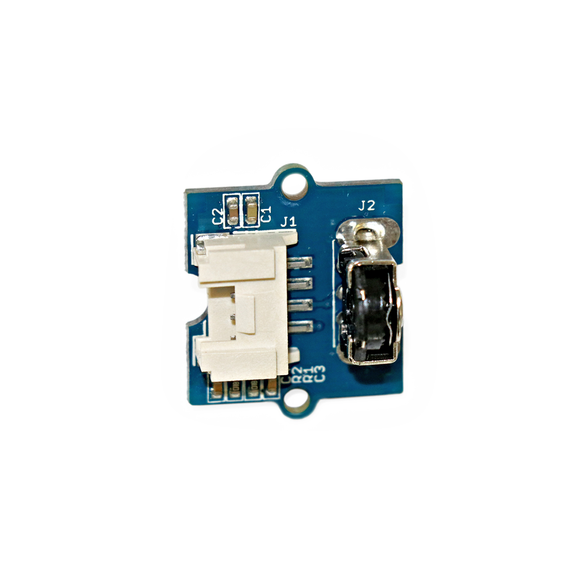

---
title: "Drehgeschwindigkeitssensor"
date: "2018-10-01T13:41:01.000Z"
tags: 
  - "sensor"
coverImage: "22_drehgeschwindigkeitssensor.jpg"
material_number: "22"
material_type: "sensor"
material_short_descr: "Seeed Studio Grove – Mouse Encoder"
manufacture: "Seeed Studio"
manufacture_url: "https://www.seeedstudio.com/"
repo_name: "mks-SeeedStudio-Grove_Mouse_Encoder"
repo_prefix: "mks"
repo_manufacture: "SeeedStudio"
repo_part: "Grove_Mouse_Encoder"
product_url: "https://wiki.seeedstudio.com/Grove-Mouse_Encoder/"
clone_url: "https://github.com/Make-Your-School/mks-SeeedStudio-Grove_Mouse_Encoder.git"
embedded_example_file: "examples/Grove_Mouse_Encoder_minimal/Grove_Mouse_Encoder_minimal.ino"
---

# Drehgeschwindigkeitssensor

## Beschreibung
Der Drehgeschwindigkeitssensor wird eingesetzt, um die Drehgeschwindigkeit einer daran angesteckten Drehachse zu ermitteln. Der Sensor gibt einzelne Spannungsimpulse immer dann aus, wenn bestimmte Winkelpositionen erreicht werden. Über die Länge und Frequenz der ausgegebenen Pulse kann schließlich auf die Drehgeschwindigkeit der Drehachse geschlossen werden. Der Sensor kann direkt oder mithilfe des Grove Shields an einen \[simple\_tooltip content='

Digital vs. analog:

- Analoge Signale können beliebige kontinuierliche Werte annehmen. Sie verändern sich stufenlos. Dadurch können theoretisch unendlich viele kleine Änderungen (und damit ein unendlicher Informationsinhalt) übertragen werden. Einschränkend wirkt die Genauigkeit, mit der das analoge Signal ausgelesen/erfasst wird.
- Das digitale Signal nimmt nur diskrete Werte an und springt bei einer etwaigen Änderung von einem Wert zum nächsten. Es kann nur eine definierte Anzahl an Informationsinhalten übertragen werden. Vorteilhaft ist dagegen die damit verbundene Fehlerfreiheit bei minimalsten, ungewollten Schwankungen. Oftmals werden nur zwei Werte HIGH und LOW (Ein/Aus oder 1/0) übermittelt.

'\]digitalen\[/simple\_tooltip\] \[simple\_tooltip content='Die Mikrocontroller besitzen kleine metallische Kontakte, an die Komponenten, Shields oder andere Platinen angeschlossen werden können. Diese Kontakte werden Pins genannt und können oft als sogenannte GPIO’s (Allzweck Ein- und Ausgabe) eingesetzt werden. Dies bedeutet, dass diese Pins direkt über die Programmierung des Mikrocontrollers angesprochen werden können und hierbei sogar bestimmt werden kann, ob dieser Pin als Eingang (beispielsweise zum Auslesen eines Sensors) oder als Ausgang (beispielsweise zur Steuerung eines Motors) genutzt werden kann. Praktisches Beispiel: Wird am Arduino eine LED an Pin 1 angeschlossen, kann im Programm direkt der Pin 1 als „An“ oder „Aus“ definiert werden und damit die LED an- oder ausgeschaltet werden.'\]Pin\[/simple\_tooltip\] des Arduinos oder Raspberry Pis angeschlossen werden.

Der Sensor kann beispielsweise eingesetzt werden, um die Drehgeschwindigkeit einer Motorachse oder einer Handkurbel zu bestimmen.

Alle weiteren Hintergrundinformationen sowie ein Beispielaufbau und alle notwendigen Programmbibliotheken sind auf dem offiziellen Wiki (bisher nur in englischer Sprache) von Seeed Studio zusammengefasst. Zusätzlich findet man über alle gängigen Suchmaschinen durch die Eingabe der genauen Komponentenbezeichnung entsprechende Projektbeispiele und Tutorials.

<!-- infolist -->

<!-- infolists -->
## Wichtige Links für die ersten Schritte:

- [Seeed Studio Wiki](http://wiki.seeedstudio.com/Grove-Mouse_Encoder/) [- Drehgeschwindigkeitssensor](http://wiki.seeedstudio.com/Grove-Mouse_Encoder/)

## Weiterführende Hintergrundinformationen:

- [GPIO - Wikipedia Artikel](https://de.wikipedia.org/wiki/Allzweckeingabe/-ausgabe)
- [GitHub: Repository: Drehgeschwindigkeitssensor](https://github.com/MakeYourSchool/22-Drehgeschwindigkeitssensor)

