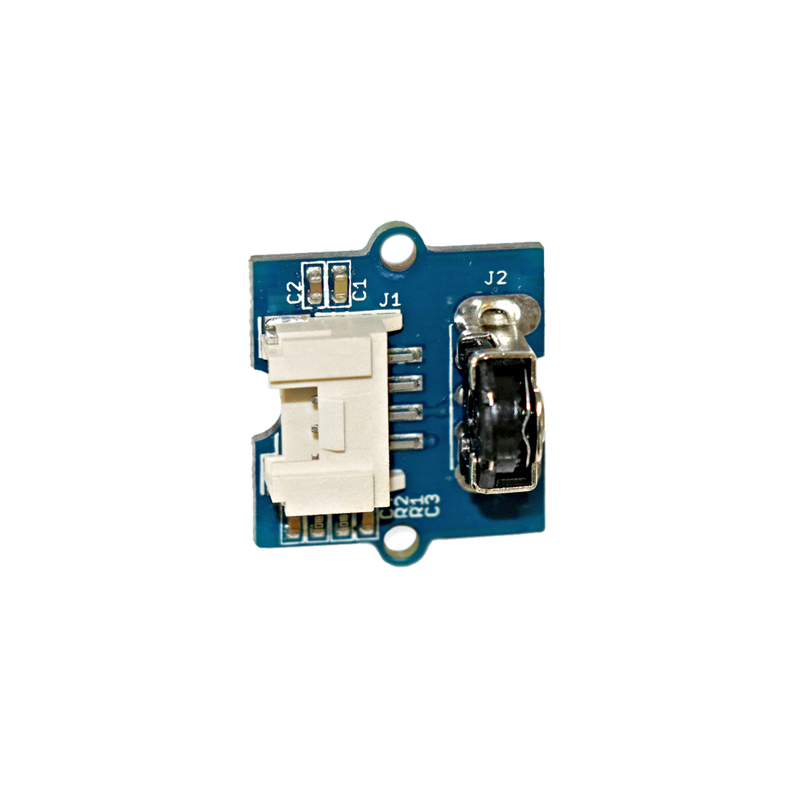

# Drehgeschwindigkeitssensor

## Beschreibung
Der Drehgeschwindigkeitssensor wird eingesetzt, um die Drehgeschwindigkeit einer daran angesteckten Drehachse zu ermitteln. Der Sensor gibt einzelne Spannungsimpulse immer dann aus, wenn bestimmte Winkelpositionen erreicht werden. Über die Länge und Frequenz der ausgegebenen Pulse kann schließlich auf die Drehgeschwindigkeit der Drehachse geschlossen werden. Der Sensor kann direkt oder mithilfe des Grove Shields an einen digitalen Pin des Arduinos oder Raspberry Pis angeschlossen werden.

Der Sensor kann beispielsweise eingesetzt werden, um die Drehgeschwindigkeit einer Motorachse oder einer Handkurbel zu bestimmen.

Alle weiteren Hintergrundinformationen sowie ein Beispielaufbau und alle notwendigen Programmbibliotheken sind auf dem offiziellen Wiki (bisher nur in englischer Sprache) von Seeed Studio zusammengefasst. Zusätzlich findet man über alle gängigen Suchmaschinen durch die Eingabe der genauen Komponentenbezeichnung entsprechende Projektbeispiele und Tutorials.

## Beispiele

!!!show-examples:./examples/

<!-- infolist -->

## Wichtige Links für die ersten Schritte:

- [Seeed Studio Wiki](http://wiki.seeedstudio.com/Grove-Mouse_Encoder/) [- Drehgeschwindigkeitssensor](http://wiki.seeedstudio.com/Grove-Mouse_Encoder/)

## Weiterführende Hintergrundinformationen:

- [GPIO - Wikipedia Artikel](https://de.wikipedia.org/wiki/Allzweckeingabe/-ausgabe)
- [GitHub: Repository: Drehgeschwindigkeitssensor](https://github.com/MakeYourSchool/22-Drehgeschwindigkeitssensor)

